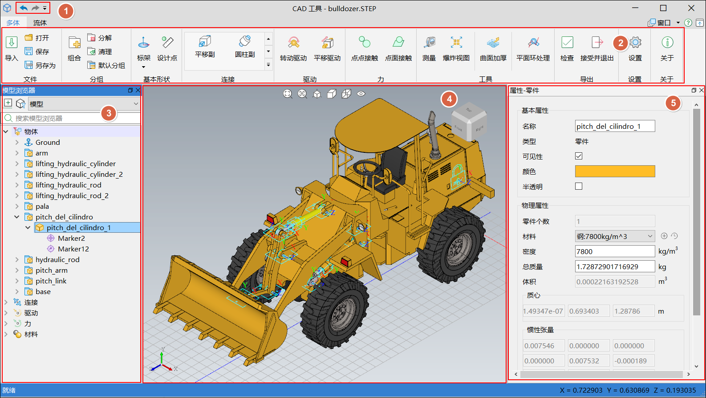
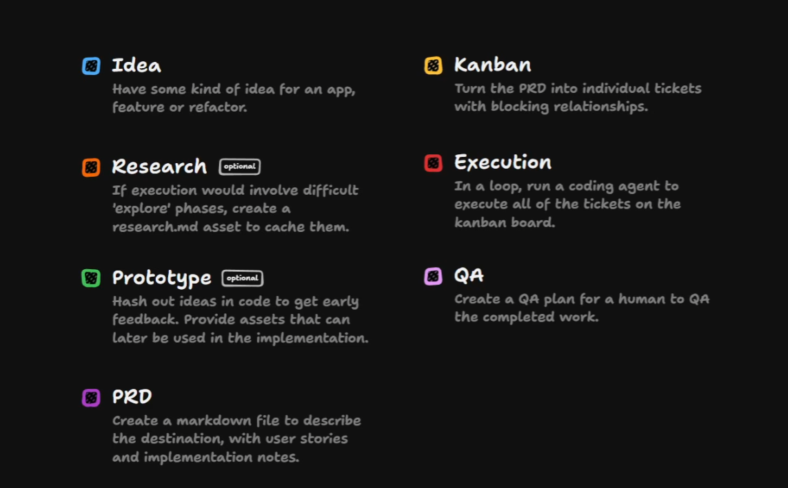
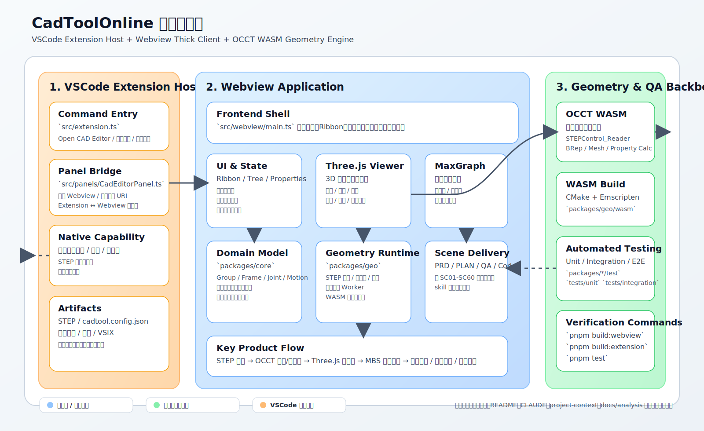

# CadToolOnline 项目 AI 编程七步法技术分享

> 适用场景：15-20 分钟技术分享 / 项目复盘 / AI 编程经验交流  
> 关键词：桌面软件 Web 化、OCCT、WebAssembly、场景化交付、持续测试、AI 工程化

## 1. 开场

今天这次分享，我想讲的不是“AI 帮我多写了多少行代码”，而是另一个更重要的问题：

**面对一个复杂的工业软件 Web 化项目，怎样把 AI 从一个问答助手，变成一个真正参与交付的工程协作者。**

CadToolOnline 很适合拿来讲这个话题。因为它不是一个普通的 CRUD 项目，而是一个典型的高复杂度迁移项目：

- 原始产品是桌面版 `CADToolbox`，技术栈是 `Qt 5.14.2 + OCCT 7.7.0`。
- 目标产品是 `CadToolOnline`，形态是 VSCode 插件，要在 Web 技术栈中承接三维 CAD 与多体动力学设计能力。
- 中间最大的难点，是几何引擎 `OCCT` 原本属于 C++/Qt 体系，而 Web 化要求它能在浏览器或 Webview 中可调用、可计算、可渲染、可测试。

也就是说，这个项目天然不适合一句 prompt 直接“生成全部代码”。如果没有方法，AI 很快就会失真、跑偏、返工。

所以我们最终沉淀出一套七步法，把 AI 编程过程拆成从创意、研究、原型、PRD、计划、执行到 QA 的完整链路。

## 2. 项目背景与核心挑战

先用一句话概括项目目标：

**把桌面版 CADToolbox，迁移为运行在 VSCode 内的在线 CAD 工具，实现 STEP 导入、三维可视化、多体设计对象建模，以及后续导出与拓扑表达能力。**

这个目标在仓库中的几个核心事实源分别是：

- `TASK.md`：定义了桌面产品、目标产品和两种技术方案。
- `CLAUDE.md`：沉淀了当前推荐技术栈和核心模块映射。
- `.claude/agents/project-context.md`：沉淀了技术方案、软件架构和开发指南。
- `README.md`：说明当前已具备 STEP 导入、3D 可视化和基础建模能力。

这个项目之所以难，主要不是难在“写页面”，而是难在下面四点：

- 几何内核迁移难。OCCT 原本服务于桌面 C++ 体系，要转成 Web 可调用能力。
- 交互复杂度高。三维拾取、对象树、属性面板、Ribbon 入口、导入导出都要联动。
- 领域知识密集。分组、标架、关节、驱动、接触、流体对象都不是通用业务概念。
- 场景规模大。全局 PRD 中一共拆出 `SC01-SC60` 六十个原型场景，不可能靠一次性开发完成。

也正因为如此，这个项目非常适合总结 AI 编程的工程化经验。

## 3. 七步法总览

我对这张图的理解是：

- 前三步解决的是“不确定性”。
- 后四步解决的是“可交付性”。
- 真正决定项目能不能推进下去的，不是某一步做得多快，而是这七步能不能串成闭环。

如果用一句话概括七步法：

1. `Idea`：先把问题定义清楚。  
2. `Research`：先把技术可行性跑通。  
3. `Prototype`：先把界面和交互落成可视化事实。  
4. `PRD`：先把复杂系统切成可以开发的最小场景。  
5. `Kanban`：先把阶段目标、依赖关系和进度管理起来。  
6. `Execute`：按场景最小闭环推进代码实现。  
7. `QA`：让测试与验证从开发第一天就进入主链路。  

## 4. 从时间轴看，七步法不是串行瀑布

这里有一个非常关键的经验：**七步法不是 1 到 7 依次做完，而是前 3 步偏顺序，后 4 步强并行。**

更准确地说：

- `Idea -> Research -> Prototype` 是前期降风险阶段。
- 从 `PRD` 开始，就进入 `PRD / Kanban / Execute / QA` 并行迭代阶段。

这也是我认为 AI 编程里最容易被忽略的一点。很多团队会把 AI 只用于“写代码”，但对复杂项目来说，真正耗时的并不是敲代码本身，而是：

- 需求边界不清导致返工。
- 技术方案不稳导致推倒重来。
- 原型和实现脱节导致误解。
- 没有测试闭环导致每轮修改都不放心。

CadToolOnline 的做法，是把这些不确定性前移，并把文档、计划、代码和测试绑在一起迭代。

## 5. 七步法在 CadToolOnline 中的具体落地

### 5.1 Idea 创意想法：先把问题说对

这一步的输入主要来自 `TASK.md`。

我们不是从“我要做一个 Web 页面”出发，而是从一个明确的工程命题出发：

- 现有产品 `CADToolbox` 是桌面版工业软件。
- 它基于 `OCCT` 这样的几何引擎，且运行在 `Qt/C++` 体系。
- 目标不是简单重画 UI，而是把核心设计能力迁移到在线环境中。

这一步最重要的价值，不是生成答案，而是**把真正的问题暴露出来**：

- Web 化的最大障碍不是普通前端开发，而是几何内核迁移。
- 如果几何能力不能落地，后面的 UI、PRD、执行都会失去意义。

所以在这个阶段，AI 的角色更像“问题澄清器”，帮助我们把项目从“一个模糊想法”，收敛成“一个明确的工程问题”。

### 5.2 Research 研究：先证明技术路线可行

这一步最关键的参考对象是开源项目 `chili3d`。

它给我们的启发非常直接：

- `OCCT` 可以通过 `WebAssembly` 编译成 wasm。
- 浏览器端或 Webview 端可以直接调用几何引擎完成计算。
- 三维显示层可以由 `three.js` 承接。

基于这个研究结果，项目在 `CLAUDE.md` 和 `.claude/agents/project-context.md` 中沉淀出了一套可执行的软件架构：

- 几何内核：`OCCT WebAssembly`
- 三维渲染：`three.js`
- 拓扑图：`@maxgraph/core`
- 工程形态：`VSCode Extension + Webview`
- 应用层策略：优先采用“`OCCT WASM + JS/TS 重写应用层`”的方案

这一步的经验非常明确：

**AI 研究不是为了堆资料，而是为了把“看起来能做”变成“知道该怎么做”。**

### 5.3 Prototype 原型设计：先把交互和界面可视化

这一步我们没有从零手工画图，而是直接基于 CADTool 的帮助文档，生成了全量的 `pencil` 格式 UI/UX 原型，文件就是 `cadtoolonline.pen`。

这件事的意义非常大：

- 它让“帮助文档”从文字说明，变成了可视化原型事实源。
- 它让后续 PRD、场景拆分和实现有了统一参考。
- 它避免了传统流程里“文档一套、设计一套、开发再理解一套”的三次偏差。

同时，从当前仓库状态看，原型阶段不是只停留在图纸层面，而是已经搭起了真实软件骨架：

- `README.md` 明确当前已具备 STEP 导入与三维可视化能力。
- `packages/geo` 承接 STEP 与 WASM。
- `packages/three` 承接 3D 展示与交互。
- `src/extension.ts`、`src/webview/main.ts` 承接 VSCode 插件和 Webview 主链路。

所以这一步不是“做个样子”，而是在原型和架构之间建立映射关系。

### 5.4 PRD 产品详细设计：先把复杂产品切成场景

这是整个七步法里最关键的一步之一。

我们不是直接写一份笼统 PRD，而是做了两层设计：

- 第一层是全局 PRD：`docs/prd/global/GLOBAL_PRD_CADToolOnline_三维建模界面重建_2026-03-06.md`
- 第二层是场景 PRD：把复杂产品继续拆成 `SC01-SC60` 六十个场景

这份全局 PRD非常重要，因为它完成了三件事情：

- 把帮助文档页映射成具体场景。
- 把原型画板和 PRD 建立一一对应关系。
- 把复杂功能拆成可逐个验证、逐个交付的场景单元。

例如：

- `SC01` 是“多体设计-添加接触”
- `SC12` 是“导入中性格式 CAD 模型”
- 每个场景都可以继续沉淀为该场景自己的 PRD、PLAN、QA 和代码实现

这也是本项目一个很值得分享的经验：

**当产品复杂到无法整体开发时，AI 的正确用法不是让它一次输出全部方案，而是先把系统切成可交付场景。**

### 5.5 Kanban 看板计划：让开发从“知道要做什么”变成“知道先做什么”

在全局 PRD 之外，我们还把计划层单独沉淀下来。

当前仓库中已经可以看到两类计划资产：

- 全局开发计划基线：`docs/plan/global/GLOBAL_PLAN_CadToolOnline_帮助文档对齐开发计划_2026-03-13.md`
- 场景计划：如 `docs/plan/scenarios/SC01_PLAN_添加接触_2026-03-11.md`

这一步的价值，不是多写一份文档，而是解决 AI 编程里很常见的一个问题：**模型会给你很多正确的建议，但不会天然替你管理顺序和依赖。**

看板计划在这里承担了三个作用：

- 把全局目标拆成阶段目标。
- 把阶段目标继续拆成场景级开发计划。
- 允许在执行过程中不断迭代修正，而不是一开始就把计划锁死。

所以 Kanban 不是附属品，而是 AI 与工程节奏之间的桥梁。

### 5.6 Execute 开发执行：把“按场景交付”固化成技能

真正进入开发阶段后，本项目没有采用“大而全的一次性重写”，而是采用“场景最小闭环”的方式推进。

这件事最典型的体现，就是我们把场景交付流程做成了一个 skill：`.codex/skills/cad-scene-delivery/SKILL.md`。

它的核心思路是：

- 当输入一个场景 ID，例如 `SC01`
- AI 就不再只是返回一段建议
- 而是沿着固定链路推进：
  - 查场景映射
  - 读全局 PRD 和帮助页
  - 更新场景 PRD
  - 更新场景 PLAN
  - 更新场景 QA
  - 实现代码
  - 补回归测试
  - 运行验证

这一步非常关键，因为它把 AI 的能力从“会回答”变成了“会按流程交付”。

换句话说，本项目的执行经验不是“让 AI 帮我写代码”，而是：

**把高频、可重复、可验证的开发流程产品化，让 AI 按场景工作。**

### 5.7 QA 测试：把验证放进主链路，而不是收尾阶段

第七步不是最后补一个测试章节，而是和第 4 到第 6 步同步推进。

当前仓库中的测试规范在 `tests/README.md` 中已经很清楚：

- 包内单元测试贴近 `packages/core`、`packages/geo`、`packages/three`
- 根 `tests/` 承接跨包、集成、回归和未来 E2E
- 通过 `pnpm test`、`pnpm test:root:run` 等命令执行不同层级的验证

这一步特别值得强调两点：

- 第一，测试不是开发完成后的证明，而是开发过程中的护栏。
- 第二，AI 每改一次代码，都应当跑对应影响域的验证，而不是等到最后统一补测。

对 CadToolOnline 这种复杂交互项目来说，如果没有持续测试，AI 每次修改都可能引入新的 UI 联动、配置导入导出或三维交互回归。

因此，QA 在这里不是“第七步结束动作”，而是整个并行迭代阶段的稳定器。

## 6. 这套方法为什么有效

如果让我总结这套七步法为什么在这个项目里有效，我会归纳为五点。

### 6.1 它先解决事实源问题

我们不是直接对着空白需求让 AI 发挥，而是先建立了清晰的事实源：

- `TASK.md` 是问题定义
- `CLAUDE.md` 和 `project-context.md` 是技术方案
- `cadtoolonline.pen` 是可视化原型
- 全局 PRD 是产品拆解
- 场景 skill 是执行流程
- `tests/README.md` 是验证规范

事实源越清楚，AI 产出越稳定。

### 6.2 它把复杂系统切成了可交付单元

`SC01-SC60` 的场景化拆分，极大降低了复杂软件开发的心智负担。

对 AI 来说，这意味着：

- 上下文更小
- 目标更清楚
- 交付结果更容易验证

### 6.3 它让文档、计划、代码、测试同步演化

很多团队的真实问题不是“AI 代码写得不好”，而是：

- 文档和代码脱节
- 计划和执行脱节
- 测试和实现脱节

而 CadToolOnline 的方式，是从一开始就把它们放到一个迭代闭环里。

### 6.4 它把 AI 的输出从一次性答案变成工程资产

单次 prompt 的价值有限，skill、PRD、原型、测试规范才是可复用资产。

项目越复杂，越不能只靠“这次回答得很好”；必须沉淀成下次还能继续复用的工程结构。

### 6.5 它真正提升的是“减少返工”的效率

复杂项目里最贵的不是写代码，而是返工。

七步法带来的最大收益，不只是编码更快，而是：

- 技术路线更早收敛
- 交互原型更早对齐
- 场景边界更早明确
- 回归风险更早暴露

这才是 AI 编程在工程里真正能放大的效率。

## 7. 我认为最值得带走的几点经验

最后我想把这次实践浓缩成几条可以复用的方法。

### 7.1 AI 编程不要从代码开始，要从问题定义开始

如果 `Idea` 这一步没有做清楚，后面的代码越多，偏差只会越大。

### 7.2 研究阶段一定要找到“可落地的技术锚点”

对本项目来说，这个锚点就是 `chili3d + WebAssembly + OCCT`。  
没有这个锚点，Web 化只是一个口号。

### 7.3 原型不是设计附件，而是后续开发的事实源

把帮助文档转成 `cadtoolonline.pen`，相当于把产品知识从说明书升级成了可执行的设计资产。

### 7.4 复杂产品一定要场景化，不要整体化

面对六十个场景的工业软件，正确方法不是“一口吃掉”，而是“一次交付一个最小闭环”。

### 7.5 QA 必须前置，测试必须伴随每轮修改

只有这样，AI 才能在持续修改中保持可控，而不是越改越不敢动。

## 8. 结语

如果要用一句话结束今天的分享，我会这样总结：

**AI 编程真正适合解决的，不只是“写代码更快”，而是“让复杂工程从模糊走向可验证交付”。**

CadToolOnline 这个项目给我的最大启发是：

- 复杂软件项目里，AI 最有价值的地方不是替代工程方法，而是放大工程方法。
- 方法一旦正确，AI 就不只是生成器，而能成为可持续协作的交付系统。

这也是为什么我最终会用这张七步法图来总结整个项目。因为它描述的不是一个提示词技巧，而是一条完整的 AI 工程化开发路径。

## 9. 汇报时可展示的仓库材料

- 问题定义：[`TASK.md`](../../../TASK.md)
- 技术方案：[`CLAUDE.md`](../../../CLAUDE.md)
- 项目上下文：[`.claude/agents/project-context.md`](../../../.claude/agents/project-context.md)
- 当前产品说明：[`README.md`](../../../README.md)
- 原型文件：[`cadtoolonline.pen`](../../../cadtoolonline.pen)
- 七步法配图：[`7-phase.png`](./7-phase.png)
- 技术架构图：[`cadtoolonline-technical-architecture.svg`](./cadtoolonline-technical-architecture.svg)
- 全局 PRD：[`GLOBAL_PRD_CADToolOnline_三维建模界面重建_2026-03-06.md`](../../prd/global/GLOBAL_PRD_CADToolOnline_三维建模界面重建_2026-03-06.md)
- 全局计划基线：[`GLOBAL_PLAN_CadToolOnline_帮助文档对齐开发计划_2026-03-13.md`](../../plan/global/GLOBAL_PLAN_CadToolOnline_帮助文档对齐开发计划_2026-03-13.md)
- 场景计划示例：[`SC01_PLAN_添加接触_2026-03-11.md`](../../plan/scenarios/SC01_PLAN_添加接触_2026-03-11.md)
- 场景 PRD 示例：[`SC01_PRD_添加接触_2026-03-11.md`](../../prd/scenarios/SC01_PRD_添加接触_2026-03-11.md)
- 场景 QA 示例：[`SC01_QA_添加接触_2026-03-11.md`](../../qa/plans/SC01_QA_添加接触_2026-03-11.md)
- 场景交付 skill：[`.codex/skills/cad-scene-delivery/SKILL.md`](../../../.codex/skills/cad-scene-delivery/SKILL.md)
- 测试规范：[`tests/README.md`](../../../tests/README.md)
